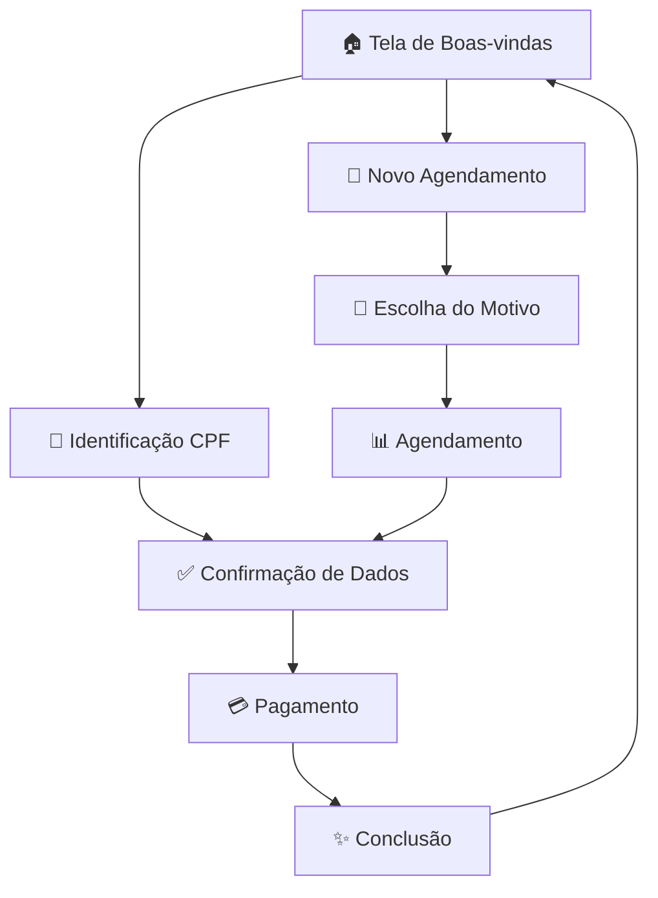

# 🌅 Totem de Bem-Estar "Amanhecer"

> **Uma interface de totem interativo com filosofia "Calma Orgânica"**

Um sistema completo de totem para clínicas de bem-estar, desenvolvido com foco na experiência do usuário e tranquilidade. A interface foi projetada para reduzir a ansiedade do paciente através de um design minimalista, suave e orgânico.

## ✨ Características Principais

### 🎨 **Filosofia Visual "Calma Orgânica"**
- **Design Minimalista**: Interface limpa que "respira" e guia o usuário gentilmente
- **Paleta Suave**: Cores dessaturadas com gradientes etéreos (#E9EFFF → #F8F4F2)
- **Tipografia Poppins**: Formas arredondadas e geométricas para máxima legibilidade
- **Animações Fluidas**: Transições suaves e micro-interações que humanizam a experiência

### 🚀 **Funcionalidades**
- **Check-in Digital**: Sistema de identificação por CPF com validação automática
- **Agendamento Online**: Interface intuitiva para novos agendamentos
- **Múltiplas Especialidades**: Psicologia, Nutrição, Acupuntura e mais
- **Confirmação Visual**: Animações de conclusão que celebram o sucesso
- **Sistema de Pagamento**: Interface simulada para pagamentos por aproximação

### 🎭 **Experiência do Usuário**
- **Entrada Escalonada**: Elementos aparecem em sequência coreografada
- **Feedback Tátil**: Hover effects e micro-interações responsivas
- **Respiração Visual**: Campo de CPF com animação sutil que guia o foco
- **Ícone de Conclusão**: Desenho animado em tempo real para feedback positivo

## 🛠️ **Tecnologia**

**Stack Simplificada:**
- **HTML5** - Estrutura semântica
- **CSS3** - Estilos com animações avançadas e backdrop-filter
- **JavaScript Vanilla** - Lógica de aplicação sem dependências

**Características Técnicas:**
- ✅ **Zero dependências** - Funciona em qualquer navegador moderno
- ✅ **Responsivo** - Adaptável a diferentes tamanhos de tela
- ✅ **Performance otimizada** - Carregamento instantâneo
- ✅ **Acessível** - Foco na usabilidade e navegação por teclado

## 🚀 **Como Executar**

**Pré-requisitos:** Apenas um navegador web moderno!

### Método 1: Execução Direta
```bash
# Clone o repositório
git clone https://github.com/SirCalder/TotemModularTeste.git

# Navegue até a pasta
cd TotemModularTeste

# Abra o index.html em qualquer navegador
# No Windows:
start index.html
# No macOS:
open index.html
# No Linux:
xdg-open index.html
```

### Método 2: Servidor Local (Opcional)
```bash
# Com Python
python -m http.server 8000

# Com Node.js (http-server)
npx http-server

# Acesse: http://localhost:8000
```

## 🎯 **Fluxo da Aplicação**



## 🎨 **Paleta de Cores**

```css
--bg-grad-start: #E9EFFF    /* Azul etéreo */
--bg-grad-end: #F8F4F2      /* Branco-quente */
--text-main: #5C5B7C        /* Cinza-azulado principal */
--text-secondary: #8A89A1   /* Cinza hierárquico */
--highlight-success: #80BBA2 /* Verde-água sucesso */
```

## 🔄 **Animações Principais**

- **Breathing Input**: Campo de CPF pulsa suavemente para atrair atenção
- **Fade-in Stagger**: Elementos entram em sequência com delays crescentes
- **Completion Drawing**: Ícone de check é desenhado em tempo real
- **Gentle Float**: Ícones flutuam suavemente para dar vida à interface
- **Shimmer Effect**: Efeito de brilho nos cards interativos

## 📱 **Compatibilidade**

- ✅ Chrome 60+
- ✅ Firefox 55+
- ✅ Safari 12+
- ✅ Edge 79+
- ✅ Dispositivos móveis e tablets

## 🤝 **Contribuição**

Contribuições são bem-vindas! Para contribuir:

1. Fork o projeto
2. Crie uma branch para sua feature (`git checkout -b feature/AmazingFeature`)
3. Commit suas mudanças (`git commit -m 'Add some AmazingFeature'`)
4. Push para a branch (`git push origin feature/AmazingFeature`)
5. Abra um Pull Request

## 📄 **Licença**

Este projeto está sob a licença MIT. Veja o arquivo [LICENSE](LICENSE) para detalhes.

## 🎉 **Criado com**

- 💻 Desenvolvido com paixão por experiência do usuário
- 🎨 Inspirado na filosofia "Calma Orgânica"
- ✨ Focado em bem-estar e tranquilidade

---

<div align="center">
  <strong>🌅 Sua jornada para o bem-estar começa aqui</strong>
</div>
