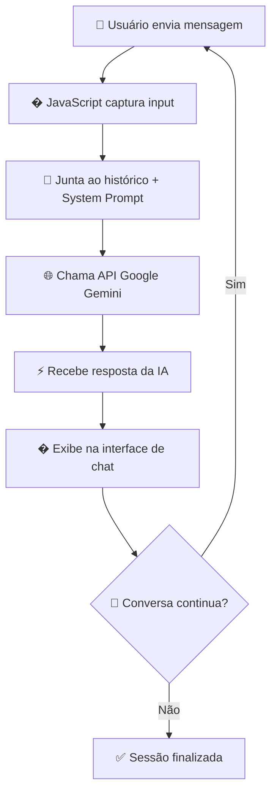

# 🌅 Secretaria Digital "Amanhecer"

> **Um agente de IA conversacional com filosofia "Calma Orgânica"**

Uma **Secretaria Digital** baseada em IA conversacional para clínicas de bem-estar, desenvolvida como MVP de um agente de atendimento modular. Combina **personalidade orgânica**, **inteligência artificial** e **interface de chat reativa** para criar uma experiência de atendimento acolhedora e eficiente.

## 🚀 Início Rápido

### 1. Configure sua API Key (Obrigatório)

```bash
# 1. Copie o arquivo de configuração
copy config.example.js config.js

# 2. Edite config.js e adicione sua API Key do Google Gemini
# Obtenha sua key em: https://makersuite.google.com/app/apikey

# 3. Execute um servidor local
python -m http.server 8080

# 4. Acesse http://localhost:8080
```

**🔐 Sua API key está protegida** - o arquivo `config.js` nunca será enviado para o GitHub!

📖 **Documentação completa:** [SETUP_SEGURO.md](SETUP_SEGURO.md)

## ✨ Características Principais

### 🤖 **Agente de IA com Personalidade "Calma Orgânica"**
- **Personalidade Consistente**: Definida via System Prompt com tom acolhedor e profissional
- **Respostas Contextuais**: Mantém histórico da conversa para interações inteligentes
- **Capacidades Modulares**: Funcionalidades facilmente expansíveis via prompts
- **Fallbacks Graceful**: Lida elegantemente com cenários inesperados

### � **Interface de Chat Reativa**
- **Conversa Fluida**: Interface moderna e responsiva para diálogo natural
- **Indicadores Visuais**: Status de digitação, processamento e estados da IA
- **Histórico Persistente**: Mantém contexto durante toda a sessão
- **Design Orgânico**: Preserva a filosofia visual "Calma Orgânica"

### 🧠 **Integração com Google Gemini API**
- **IA de Ponta**: Processamento avançado de linguagem natural
- **Contextualização Inteligente**: Respostas baseadas no histórico da conversa
- **Gestão de API**: Sistema robusto de chamadas e tratamento de erros
- **Performance Otimizada**: Requisições eficientes e caching inteligente

### 🔧 **Arquitetura Modular**
- **System Prompt Flexível**: Fácil configuração de personalidade e capacidades
- **Separação de Responsabilidades**: UI, lógica de IA e dados bem estruturados
- **Estado Conversacional**: Gestão inteligente do fluxo de diálogo
- **Zero Build Tools**: HTML/CSS/JS puro para deployment imediato

## 🛠️ **Tecnologia**

**Stack Conversacional:**
- **HTML5** - Estrutura semântica para interface de chat
- **CSS3** - Design orgânico com animações suaves
- **JavaScript Vanilla** - Lógica conversacional e integração com IA
- **Google Gemini API** - Motor de inteligência artificial

**Características Técnicas:**
- ✅ **IA Integrada** - Powered by Google Gemini para respostas inteligentes
- ✅ **Responsivo** - Interface de chat adaptável a qualquer dispositivo
- ✅ **Performance otimizada** - Carregamento instantâneo e requests eficientes
- ✅ **Modular** - Capacidades da IA facilmente expansíveis
- ✅ **Acessível** - Compatível com screen readers e navegação por teclado

## 🚀 **Como Executar**

**Pré-requisitos:**
- Navegador web moderno
- **API Key do Google Gemini** (obrigatório para funcionalidade de IA)

### Configuração da API
1. Obtenha uma API Key do Google AI Studio
2. Configure a variável `API_KEY` no arquivo `script.js`
3. Certifique-se de que as requisições CORS estão habilitadas

### Método 1: Execução Direta
```bash
# Clone o repositório
git clone https://github.com/SirCalder/TotemModularTeste.git

# Navegue até a pasta
cd TotemModularTeste

# Configure sua API_KEY no script.js
# Abra o index.html em qualquer navegador
start index.html
```

### Método 2: Servidor Local (Recomendado)
```bash
# Com Python
python -m http.server 8000

# Com Node.js (http-server)
npx http-server

# Acesse: http://localhost:8000
```

## 🎯 **Fluxo Conversacional**



## 🎨 **Paleta de Cores**

```css
--bg-grad-start: #E9EFFF    /* Azul etéreo */
--bg-grad-end: #F8F4F2      /* Branco-quente */
--text-main: #5C5B7C        /* Cinza-azulado principal */
--text-secondary: #8A89A1   /* Cinza hierárquico */
--highlight-success: #80BBA2 /* Verde-água sucesso */
```

## 🤖 **Personalidade da IA**

- **Tom Acolhedor**: Respostas calorosas mas profissionais, reflexo da "Calma Orgânica"
- **Contextualização**: Lembra conversas anteriores para continuidade natural
- **Capacidades Modulares**: Agendamentos, informações, suporte geral
- **Fallback Graceful**: Lida elegantemente com perguntas fora do escopo
- **Brevidade Inteligente**: Respostas concisas mas completas

## 📱 **Compatibilidade**

- ✅ Chrome 60+
- ✅ Firefox 55+
- ✅ Safari 12+
- ✅ Edge 79+
- ✅ Dispositivos móveis e tablets

## 🤝 **Contribuição**

Contribuições são bem-vindas! Para contribuir:

1. Fork o projeto
2. Crie uma branch para sua feature (`git checkout -b feature/AmazingFeature`)
3. Commit suas mudanças (`git commit -m 'Add some AmazingFeature'`)
4. Push para a branch (`git push origin feature/AmazingFeature`)
5. Abra um Pull Request

## 📄 **Licença**

Este projeto está sob a licença MIT. Veja o arquivo [LICENSE](LICENSE) para detalhes.

## 🎉 **Criado com**

- 🤖 Desenvolvido com IA conversacional avançada
- 🎨 Inspirado na filosofia "Calma Orgânica"
- 💬 Focado em comunicação natural e acolhedora
- ✨ Primeira iteração de um agente modular completo

---

<div align="center">
  <strong>🌅 Sua secretária digital de bem-estar está aqui para ajudar</strong>
</div>
